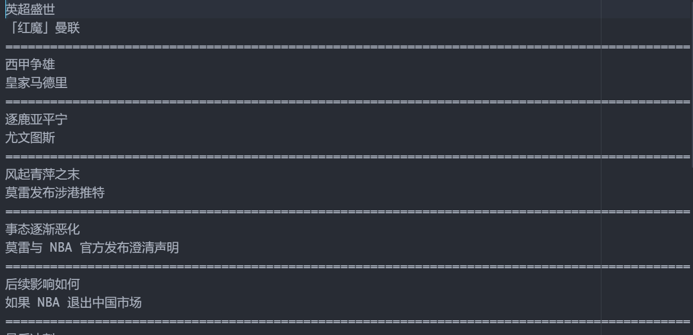

# Python3 网络爬虫课程
## 文件存储
用解析器解析出数据后，就该存储数据了。保存数据的形式有多种，最简单的方式为保存为文件，如JSON、CSV、TXT等。
### TXT存储
将数据保存为TXT文本非常简单，TXT文件可以兼容任何平台，但是不太利于检索，如果对检索数据和数据结构要求不高的话，可以存储为TXT。
#### 实例
```
import requests
from pyquery import PyQuery as pq
url = 'https://www.zhihu.com/explore'
headers = {'User-Agent': 'Mozilla/5.0 (Windows NT 10.0; WOW64) \
AppleWebKit/537.36 (KHTML, like Gecko) Chrome/74.0.3729.169 Safari/537.36'}
response = requests.get(url, headers=headers)
html = response.text
doc = pq(html)
items = doc('.ExploreSpecialCard-contentList .ExploreSpecialCard-contentItem').items()
for item in items:
    tag = item.find('.ExploreSpecialCard-contentTag').text()
    title = item.find('.ExploreSpecialCard-contentTitle').text()
    file = open('explore.txt', 'a', encoding='utf-8')
    file.write('\n'.join([tag, title]))
    file.write('\n' + '=' * 100 + '\n')
    file.close()
```
为了演示,这里不处理异常情况,使用requests.get()获取知乎的发现页面后,使用pyquery解析得到的html,将tag和title提取出来,然后使用open()方法打开文件,使用write方法将提取的内容写入文件.结果如下:

#### 文件打开方式
上面的实例中,使用了file.open()方法,其第二个参数为'a',表示每次在文件末尾写入新的内容.关于打开文件的方式,还有其他方式:
##### r: 只读方式打开文件.这是默认方式
##### rb:二进制只读方式打开文件,其他和r类似
##### r+:以读写方式打开文件
##### rb+:以二进制读写方式打开文件
##### w: 以写方式打开文件,如果该文件存在,则被覆盖;如果不存在,则创建文件.
##### wb:以二进制写方式打开文件,其他同w
##### w+:以读写方式打开文件,如果该文件存在,则被覆盖;如果不存在,则创建文件.
##### wb+:以二进制读写方式打开文件,其他容w+
##### a: 以追加方式打开一个文件,如果文件已存在,则在末尾增加内容;如果文件不存在,则创建文件并写入
##### ab:以二进制追加方式打开一个文件,其他同a
##### a+:以读写方式打开文件,如果文件已存在,则在末尾增加内容;如果文件不存在,则创建文件并写入
##### ab+:以二进制读写方式打开文件,其他同a+
#### 简化写法
文件写入还可以使用with as语法,这是一种简化语法,在使用with语法时,不必使用close()方法关闭文件,文件会自动关闭.
```
with open('explore.txt', 'a', encoding='utf-8') as file:
      file.write('\n'.join([tag, title]))
      file.write('\n' + '=' * 100 + '\n')
```
### JSON存储
JSON全称为Javascript Object Notation.它通过对象和数组的组合来表示数据,构造简洁结构化程度高,是一种轻量级的数据交换方式.
#### 对象和数组
在Javascript中,一切都可以表示为对象,因此,任何支持的类型都可以表示为JSON.
##### 对象:在Javascript中是使用花括号{}包裹的内容,结构为{'key1':'value1','key2':'value2'}
##### 数组:在Javascript中是使用方括号[]包裹的内容.
示例如下:
```
[
    {
      "name": "Amy",
      "age":24,
      "address":"New York"
    },
    {
      "name": "Lily",
      "age":21,
      "address":"Seattle"
    }
  ]
```
#### 读取JSON
Python提供了JSON库来实现JSON文件的读写操作,可以调用其loads()方法将JSON字符串转为JSON对象,调用dumps()方法将JSON对象转换为JSON字符串
```
import json

str = '''
    [
      {
        "name": "Amy",
        "age":24,
        "address":"New York"
      },
      {
        "name": "Lily",
        "age":21,
        "address":"Seattle"
      }
    ]
'''
print(type(str))
print(json.loads(str))
print(type(json.loads(str)))
```
这里使用loads()方法将JSON字符换转换为JSON对象,结果如下:  
  
这样就可以获取对应的内容了.比如想获取第一个元素的name,通过其索引0，可以得到一个字典，然后调用其键名就可以得到响应的键值。  
```
data = json.loads(str)
print(data[0]['name'])
```
还可以使用get()方法传入键名。推荐使用get()方法，如果键名不存在，则不会报错，会返回None。此外，get()方法还可以传入第二个参数
```
data = json.loads(str)
print(data[0].get('gender'))
print(data[0].get('gender', 'male'))
```
#### 输出为JSON
可以调用dumps()方法将JSON对象转换为JSON字符换，写入到文件中.将前面写入到TXT的代码改造一下，如下:
```
import requests
import json
from pyquery import PyQuery as pq
url = 'https://www.zhihu.com/explore'
headers = {'User-Agent': 'Mozilla/5.0 (Windows NT 10.0; WOW64) \
AppleWebKit/537.36 (KHTML, like Gecko) Chrome/74.0.3729.169 Safari/537.36'}
response = requests.get(url, headers=headers)
html = response.text
doc = pq(html)
items = doc('.ExploreSpecialCard-contentList .ExploreSpecialCard-contentItem').items()
for item in items:
    tag = item.find('.ExploreSpecialCard-contentTag').text()
    title = item.find('.ExploreSpecialCard-contentTitle').text()
    data = {
        'tag': tag,
        'title': title
    }
    with open('explore.json', 'a', encoding='utf-8') as file:
        file.write(json.dumps(data, ensure_ascii=False) + '\n')
```
由于输出结果中有中文，所以使用了ensure_ascii=False，否则JSON文件会被输出为Unicode字符。  
  
### CSV存储
CSV文件全称为Comma-Separated Values,以纯文本形式存储表格数据,可以使用excel打开,但其比excel更加简洁.
#### 写入
```
import csv
with open('data.csv', 'w') as file:
    writer = csv.writer(file)
    writer.writerow(['name', 'age', 'address'])
    writer.writerow(['Amy', 24, 'New York'])
    writer.writerow(['Lily', 21, 'Seattle'])
```
打开data.csv, 然后指定打开模式为w，然后调用csv的writer方法初始化写入对象，最后调用writerow方法写入内容。写入文件的默认分隔符为逗号  
  
如果使用excel打开,结果是这样的:  
  
如果想更改列与列之间的分隔符，可以传入delimiter参数
```
writer = csv.writer(file, delimiter=' ')
```
一般情况下，爬虫爬取到的都是结构化的数据，一般会使用字典表示，csv也提供了字典的写入方式
```
import csv
with open('data.csv', 'w') as file:
    fieldnames = ['name', 'age', 'address']
    writer = csv.DictWriter(file, fieldnames=fieldnames)
    writer.writeheader()
    writer.writerow({'name': 'Amy', 'age': 24, 'address': 'New York'})
    writer.writerow({'name': 'Lily', 'age': 21, 'address': 'Seattle'})
```
#### 读取
同样可以使用csv库来读取csv文件。比如将刚写入的文件读取出来
```
import csv
with open('data.csv', 'r', encoding='utf-8') as file:
    reader = csv.reader(file)
    for row in reader:
        print(row)
```
