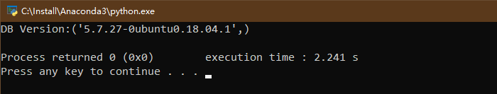
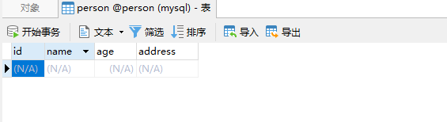
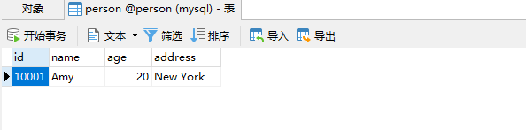
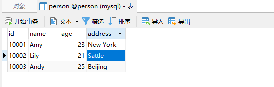
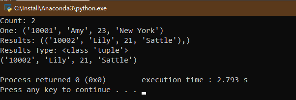

# Python3 网络爬虫课程
## 关系型数据库存储
关系型数据库是基于关系模型的数据库，而关系模型是通过二维表来表示的，所以它的存储方式为行列组成的表，每一列是一个字段，每一行是一条记录。表可以看作是某个实体的集合，而实体之间的联系就是表之间的关联关系。多个表组成一个数据库，也就是关系型的数据库。
常用的关系型数据库有**Mysql、Sqlite、Oracle、Sql Server、DB2、Mariadb、PostgreSQL**等.  
本节以**Mysql**为例进行讲解.  
### 准备工作
首先需要安装**mysql**和**Python**库**PyMysql**，第一节都有,略...  
### 连接数据库
尝试连接一下数据库，我这里**mysql**运行在本地，所以其host为localhost.   
同时创建person数据库
```
import pymysql

db = pymysql.connect(host='localhost', user='mensyli4', password='XXXXXXXX', port=3306)
cursor = db.cursor()
cursor.execute('SELECT VERSION()')
data = cursor.fetchone()
print('DB Version:{}'.format(data))
cursor.execute('CREATE DATABASE person DEFAULT CHARACTER SET utf8')
db.close()
```
运行结果如下:  
  
使用**PyMysql**的connect()方法声明一个**MySQL**链接对象db.传入**host,user,password**等
连接成功后调用cursor()方法获得**MySQL**的游标,利用游标来进行SQL操作.  
### 创建表
我们可以手动创建表,也可以使用代码来创建,如下:
```
import pymysql

db = pymysql.connect(host='localhost', user='mensyli4', password='XXXXXXXX',
                      port=3306, db='person')
cursor = db.cursor()
sql = '''CREATE TABLE IF NOT EXISTS
        person (id VARCHAR(255) NOT NULL,
                name VARCHAR(255) NOT NULL,
                age INT NOT NULL,
                address VARCHAR(255),
                PRIMARY KEY (id))
      '''
cursor.execute(sql)
db.close()

```
运行之后,创建了一个表person  

### 插入数据
假设有一些数据,怎么将其插入数据库呢?  
```
import pymysql
id = '10001'
name = 'Amy'
age = 20
address = 'New York'
db = pymysql.connect(host='localhost', user='mensyli4', password='XXXXXXXX', port=3306, db='person')
cursor = db.cursor()
sql = '''INSERT INTO person(id, name, age, address) VALUES(%s, %s, %s, %s)'''
try:
    cursor.execute(sql, (id, name, age, address))
    db.commit()
except:
    db.rollback()
finally:
    db.close()
```
结果如下:  
  
注意:执行插入数据语句之后,需要调用db对象的commit()方法,这个方法是真正将数据提交到数据库的方法.对于数据**插入、更新、删除**，都需要调用此方法。  
上面的代码里还加入了异常处理，如果调用失败，执行rollback()进行回滚操作。  
这涉及到事务的问题,事务可以确保数据的一致性,也就是这件事要么发生了,要么没发生,数据要么插入,要么没插入,不会出现插入一半的情况.  
事务的三个属性,原子性、一致性、隔离性、持久性被称为ACID特性。

| 属性 | 解释 |  
| ----- | ----- |
| 原子性(atomicity) | 事务是一个不可分割的工作单位，事务中包含的操作要么做，要么都不做 |
| 一致性(consistency) | 事务必须使数据库从一个一致性状态变到另一个一致性状态 |
| 隔离性(isolation) | 一个事务的执行不能被其他事务干扰，事务内部的数据和操作对其他事务是隔离的 |
| 持久性(durability) | 持续性也叫永久性，一个事务一旦提交，对数据库的改变就是永久的 |


很多情况下,我们插入的数据是字典形式,怎么插入呢?如下:  
```
import pymysql
data = {
    'id': '10003',
    'name': 'Andy',
    'age': 25,
    'address':'Beijing'
}
table = 'person'
keys = ', '.join(data.keys())
values = ', '.join(['%s'] * len(data))
db = pymysql.connect(host='localhost', user='mensyli4',
                    password='XXXXXXXX', port=3306, db='person')
cursor = db.cursor()
sql = '''INSERT INTO {table}({keys}) VALUES({values})''' \
            .format(table=table, keys=keys, values=values)
print(sql)
try:
    cursor.execute(sql, tuple(data.values()))
    db.commit()
except:
    db.rollback()
finally:
    db.close()
```
运行结果如下:  

### 更新数据
数据更新操作实际上也是执行sql语句，示例如下:  
```
import pymysql
db = pymysql.connect(host='localhost', user='mensyli4', password='XXXXXXXX', port=3306, db='person')
cursor = db.cursor()
sql = '''UPDATE person SET age= %s WHERE name = %s'''
try:
    cursor.execute(sql, (21, 'Amy'))
    db.commit()
except:
    db.rollback()
finally:
    db.close()
```
执行结果如下：  
  
实际的插入过程中,我们插入数据的时候,一般需要排除掉重复数据,怎么做呢?  
```
import pymysql
data = {
    'id': '10003',
    'name': 'Andy',
    'age': 25,
    'address':'Beijing'
}
table = 'person'
keys = ', '.join(data.keys())
values = ', '.join(['%s'] * len(data))
db = pymysql.connect(host='localhost', user='mensyli4',
                    password='XXXXXXXX', port=3306, db='person')
cursor = db.cursor()
sql = '''INSERT INTO {table}({keys}) VALUES({values}) ON DUPLICATE KEY UPDATE''' \
            .format(table=table, keys=keys, values=values)
print(sql)
try:
    cursor.execute(sql, tuple(data.values()))
    db.commit()
except:
    db.rollback()
finally:
    db.close()
```
### 删除数据
删除使用DELETE语句即可,只需要指定要删除的目标表名和删除条件,当然,必须执行commit()方法后才能生效  
```
import pymysql
db = pymysql.connect(host='localhost', user='mensyli4', password='XXXXXXXX', port=3306, db='person')
cursor = db.cursor()
sql = '''DELETE FROM {table} WHERE {condition}'''.format(table='person', condition='age>20')
try:
    cursor.execute(sql)
    db.commit()
except:
    db.rollback()
finally:
    db.close()
```
### 查询数据
查询使用SELECT语句来进行操作  
```
import pymysql
db = pymysql.connect(host='localhost', user='mensyli4', password='XXXXXXXX', port=3306, db='person')
cursor = db.cursor()
sql = '''SELECT * FROM person WHERE age>=20'''
try:
    cursor.execute(sql)
    print('Count:', cursor.rowcount)
    one = cursor.fetchone()
    print('One:', one)
    results = cursor.fetchall()
    print('Results:', results)
    print("Results Type:", type(results))
    for row in results:
        print(row)
except Exception as e:
    print('Error')
    print(e)
```
运行结果如下:  

