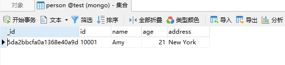
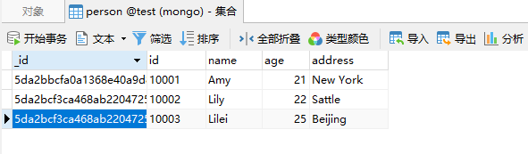
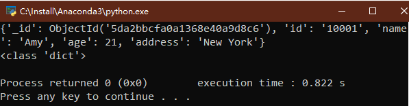
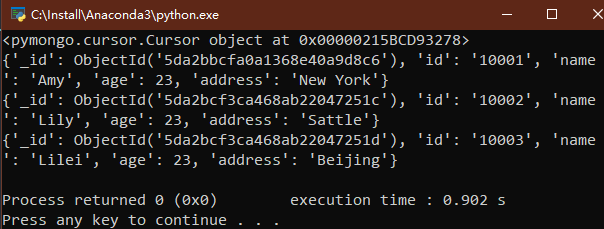
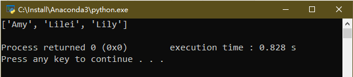

# Python3 网络爬虫课程
## 非关系型数据库存储
NoSQL，全称为Not Only SQL，不仅仅是SQL，泛指非关系型数据库。  
NoSQL是基于键值对的存储，不需要进行SQL层的解析，数据之间没有耦合性，性能高。  
非关系型数据库可以分为以下几类：

| 类型 | 代表 |  
| ----- | ----- |  
| 键值存储数据库 |Redis、Oracle DBD、Voldemort等  |
| 列存储数据库 | HBase、Riak、Cassandra等  |
| 文档型数据库 | MongoDB、CouchDB等 |
| 图形数据库 | InfoGrid、Neo4J、Infinite Graph等 |

对于爬虫爬取的数据来说，可能会有数据缺失、数据结构嵌套等情况，如果使用关系型数据库村粗的话，需要提前建表，而且表之间的关系关系，数据的序列化等都比较麻烦。如果使用非关系型数据库存储的话，就比较方便了。  
本节主要讲解MongoDB的使用。
MongoDB是一个C++编写的、基于分布式文件存储的开源的非关系型数据库系统。其内容存储形式类似于JSON对象，非常灵活。  
### 准备工作
需要安装MongoDB和PyMongo库，第一节“环境配置”都有讲，这里略过。  
### 连接MongoDB
我们使用PyMongo中的MongoClient来连接MongoDB。  
```
import pymongo
client = pymongo.MongoClient(host="localhost", port=27017)
```
另外，还可以使用下面这种方式连接MongoDB。  
```
import pymongo
client = pymongo.MongoClient("mongodb://localhost:27017/")
```
### 指定数据库
MongoDB中一般存在很多数据库，怎么指定我们需要操作的数据库呢？
```
db = client.test
```
也可以使用这种方式指定。  
```
db = client['test']
```
### 指定集合
每个数据库包含很多的集合，集合就相当于关系型数据库中的表，怎么指定我们操作的集合呢?  
```
collection = db.person
```
也可以这样写，等价于上面。
```
collection = db['person']
```
### 插入数据
对于上面的person集合，演示一下怎么插入一条数据。  
```
import pymongo
client = pymongo.MongoClient("mongodb://localhost:27017/")
db = client.test
collection = db['person']
person = {
    'id': '10001',
    'name': 'Amy',
    'age': 21,
    'address': 'New York'
}
result = collection.insert_one(person)
print(result.inserted_id)
```
执行结果如下:  
  
如果插入多条数据呢?我们可以使用insert_many().  
```
import pymongo
client = pymongo.MongoClient("mongodb://localhost:27017/")
db = client.test
collection = db['person']
person1 = {
    'id': '10002',
    'name': 'Lily',
    'age': 22,
    'address': 'Sattle'
}
person2 = {
    'id': '10003',
    'name': 'Lilei',
    'age': 25,
    'address': 'Beijing'
}
result = collection.insert_many([person1, person2])
print(result.inserted_ids)
```
执行结果如下:  

### 数据查询
可以使用find_one()方法或find()方法进行查询.  
find_one()返回单个结果,find()返回的是生成.  
```
import pymongo
client = pymongo.MongoClient("mongodb://localhost:27017/")
db = client.test
collection = db['person']
result = collection.find_one({'name': 'Amy'})
print(result)
print(type(result))
```
这里查询name='Amy'的人, 其返回类型为字典类型.  
  
如果要查询多条结果,使用find()方法.  
```
import pymongo
client = pymongo.MongoClient("mongodb://localhost:27017/")
db = client.test
collection = db['person']
results = collection.find({'age': 23})
print(results)
for result in results:
    print(result)
```
执行结果如下:  
  
如果要返回年龄大于20的数据,怎么写呢?  
```
collection.find({'age': {'$gt': 20}})
```
$gt表示大于号，其他比较符号如下所示：  

| 符号 | 含义 | 示例 |
| ----- | ----- | ----- |
| $lt | 小于 | {'age': {'$lt': 20}} |  
| $gt | 大于 | {'age': {'$gt': 20}} |
| $lte | 小于等于 | {'age': {'$lte': 20}} |   
| $gte | 大于等于 | {'age': {'$gte': 20}} |
| $ne | 不等于 | {'age': {'$ne': 20}} |
| $in | 在范围内 | {'age': {'$in': [20, 23]}} |
| $nin | 不在范围内 | {'age': {'$nin': [20, 23]}} |

另外还可以使用正则匹配：  
```
collection.find({'name': {'$regex': '^L.*'}})
```

下面是一些特殊符号的说明:
  
| 符号 | 含义 | 示例 | 示例含义 |
| ----- | ----- | ----- | ----- |
| $regex | 正则匹配 | {'name': {'$regex': '^L.*'}} | name以L开头 |
| $exists | 是否存在 | {'name': {'$exists': True}} | name属性是否存在 |
| $type | 类型判断 | {'age': {'$type': 'int'}} | age类型为int |
| $mod | 模操作 | {'age': {'$mod': [5, 0]}} | age模5余数为0 |
| $text | 文本查询 | {'$text': {'$search': 'Amy'}} | text类型的属性包含Amy字符串 |
| $where | 高级条件查询 | {'$where': obj.fans_nums == obj.follows_nums} | 粉丝数等于关注数 |

### 计数
调用count()方法，就可以查询有多少条数据。
```
collection.count_documents({})
```
如果统计符合某条件的数据的数量，可以传入条件：  
```
collection.count_documents({'age': {'$lt': 25}})
```
### 排序
直接调用sort()方法就可以排序，传入参数可以设置其为升序还是降序：  
```
import pymongo
client = pymongo.MongoClient("mongodb://localhost:27017/")
db = client.test
collection = db['person']
results = collection.find().sort('name', pymongo.ASCENDING)
print([result['name'] for result in results])
```
执行结果如下：  
  
### 偏移
如果我们只想取某几个元素或某些元素,可以使用skip()方法跳过一些元素,取到我们需要的元素:  
```
import pymongo
client = pymongo.MongoClient("mongodb://localhost:27017/")
db = client.test
collection = db['person']
results = collection.find().sort('name', pymongo.ASCENDING).skip()
print([result['name'] for result in results])
```
还可以使用limit()方法指定要取的结果的个数。  
```
collection.find().sort('name', pymongo.ASCENDING).skip(1).limit(1)
```
### 更新
使用update_one和updae_many()方法就可以更新数据，只需要指定更新的条件和更新后的数据。  
```
import pymongo
client = pymongo.MongoClient("mongodb://localhost:27017/")
db = client.test
collection = db['person']
condition = {'name': 'Amy'}
person = collection.find_one(condition)
person['age'] = 28
result = collection.update_one(condition, {'$set': person})
print(result)
```
还可以指定某个条件,给其age加1:  
```
import pymongo
client = pymongo.MongoClient("mongodb://localhost:27017/")
db = client.test
collection = db['person']
condition = {'age': {'$gt': 20}}
result = collection.update_one(condition, {'$inc': {'age': 1}})
print(result)
```
上面调用的find_one()和update_one()方法,如果批量更新的话,可以这样:  
```
import pymongo
client = pymongo.MongoClient("mongodb://localhost:27017/")
db = client.test
collection = db['person']
condition = {'age': {'$gt': 20}}
result = collection.update_many(condition, {'$inc': {'age': 1}})
print(result)
```
### 删除
删除操作比较简单，直接调用delete_one()或者delete_many()方法，传入条件即可，符合条件的所有数据都会被删除。
```
import pymongo
client = pymongo.MongoClient("mongodb://localhost:27017/")
db = client.test
collection = db['person']
result = collection.delete_one({'name': 'Amy'})
print(result)

import pymongo
client = pymongo.MongoClient("mongodb://localhost:27017/")
db = client.test
collection = db['person']
result = collection.delete_many({'age': 24})
print(result)
```
### 其他
PyMongo还提供了一些其他的方法，如find_one_and_delete()、find_one_and_replace()、  
find_one_and_update()、create_index()、create_indexes()、drop_index()等。  
不再一一赘述，有需要的话请查询PyMongo文档。
