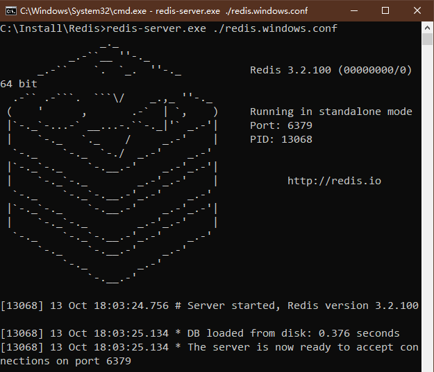
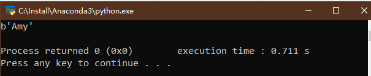

# Python3 网络爬虫课程
## Redis存储
Redis是基于内存的键值型非关系数据库,存储效率高,支持多种存储数据结构.
### 准备
第一节中,我们已经安装了Redis和redis-py库.
### Redis和StrictRedis
redis-py库提供了两个类,Redis和StrictRedis来操作redis数据库.  
StrictRedis实现了大部分官方的命令,参数也一一对应.  
Redis是StrictRedis的子类,主要是为了向后兼容.  
### 连接Redis
我已经在本地安装了Redis,其运行在localhost的6379端口上.  
  
```
from redis import StrictRedis
redis = StrictRedis(host='localhost', port=6379, db=0, password='XXXXXXXX')
redis.set('name', 'Amy')
print(redis.get('name'))
```
分别传入了host，port，db，password。在默认不传的情况下，这四个参数分别为localhost, 6379, 0, None.  
运行结果如下:  
  
我们也可以使用ConnectionPool来连接:  
```
from redis import StrictRedis, ConnectionPool
pool = ConnectionPool(host='localhost', port=6379, db=0, password='XXXXXXXX')
redis = StrictRedis(connection_pool=pool)
redis.set('name', 'Amy')
print(redis.get('name'))
```
ConnectionPool也支持使用URL来构建。  
```
from redis import StrictRedis, ConnectionPool
url = 'redis://:xiaoming98@localhost:6379/0'
url2 = 'rediss://:xiaoming98@localhost:6379/0'
pool = ConnectionPool.from_url(url)
redis = StrictRedis(connection_pool=pool)
redis.set('name', 'Amy')
print(redis.get('name'))
```
### 键操作
下面列举了一些常用的判断和操作方法。

| 方法 | 作用 | 参数说明 | 示例 | 示例说明 | 示例结果 |
| ----- | ----- | ----- | ----- | ----- | ----- |
| exists(name) | 判断一个键是否存在 | name:键名 | redis.exists('name') | 是否存在name这个键 | 1 |
| delete(name) | 删除一个键 | name:键名 | redis.delete('name') | 删除name这个键 | 1 |
| type(name) | 判断键类型 | name:键名 | redis.type('name') | 判断name键类型 | b'string' |
| keys(pattern) | 获取所有符合规则的键 | pattern:规则 | redis.keys('n*') | 获取所有以n开头的键 | [b'name'] |
| randomkey() | 获取随机键 |  | redis.keys('n*') | 获取所有以n开头的键 | [b'name'] |
| rename(src, dst) | 重命名键 | src:原键名，dst：新键名 | redis.rename('name', 'newname') | 将name重命名为newname | True |
| dbsize() | 获取键的数目 |  | redis.dbsize() | 获取键的数目 | 1 |
| expire(name, time) | 设置键的过期时间 | name:键名，time:秒 | redis.expire('name', 2) | 设置键name的过期时间为2 | True |
| ttl(name) | 获取键的过期时间 | name:键 | redis.ttl('name') | 获取键name的过期时间 | -1,表示用不过期 |
| move(name, db) | 将键移动到其他数据库 | name:键， db：数据库代号 | redis.move('name', 2) | 将键移动到2号数据库 | True |
| flushdb() | 删除当前数据库中的所有键 |  | redis.flushdb() | 删除当前数据库中的所有键 | True |
| flushall() | 删除所有数据库中的所有键 |  | redis.flushall() | 删除所有数据库中的所有键 | True |

### 字符串操作
Redis支持最基本的键值对形式存储，用法如下：  

| 方法 | 作用 | 参数说明 | 示例 | 示例说明 | 示例结果 |
| ----- | ----- | ----- | ----- | ----- | ----- |
| set(name, value) | 将数据库中键为name的string赋值为value | name:键名 | redis.set('name', 'Amy') | 键name的value赋值为Amy | True |
| get(name) | 返回键name的value | name:键名 | redis.get('name') | 返回键name的value | b'Amy' |
| getset(name, value) | 将键name赋值为value，并返回其原来的value | name：键名， value:新值 | redis.getset('name', 'Mike') | 赋值name为mike，并返回Amy | b'Amy' |
| mget(key, *args) | 返回多个键对应的value | keys：键列表 | redis.mget(['name', 'newname']) | 返回name和newname的value | [b'Amy', None] |
| setnx(name, value) | 如果不存在这个键值对，则更新value，否则不变 | name：键名 | redis.setnx('newname', 'Lilei') | 如果newname这个键不存在，则设置其value为Lilei | True |
| setex(name, time, value) | 设置name的value，并指定键的有效期 | name：键名， time：有效期， value：值 | redis.setex('name', 1, 'Lily') | 设置name的值为Lily，并设置其有效期为1s | True |
| setrange(name,offset, value) | 设置name键的value的子字符串 | name：键名， offset:偏移量， value：值 | redis.setrange('name', 2, 'world') |  | 7 |
### 列表操作
Redis提供了列表存储，列表内的元素可以重复，而且可以从两端存储。  

| 方法 | 作用 | 参数说明 | 示例 | 示例说明 | 示例结果 |
| ----- | ----- | ----- | ----- | ----- | ----- |
| rpush(name, *value) | 在name键的末尾添加value |  | redis.rpush('list1', 1,2,3) | 向list键的列表末尾添加1，2，3 | 3 |
| lpush(name, *value) | 在name键的头部添加value |  | redis.rpush('list1', 0) | 向list键的列表头部添加0 | 4 |
| llen(name) | 返回键name的列表长度 |  | redis.llen('list1') | 返回键list1的列表长度 | 4 |
| lrange(nem, start, end) | 返回start到end之间的元素 |  | redis.lrange('list1', 1, 3) | 返回键list1的列表所有1到3的列表 | [b'2', b'3', b'0'] |
| ltrim(nem, start, end) | 保留start到end之间的元素 |  | redis.ltrim('list1', 1, 3) | 保留键list1的列表所有1到3的列表 | True |
| lpop(name) | 返回并删除键为name的列表的首元素 |  | redis.lpop('list1') | 返回并删除键为name的列表的首元素 | b'2' |
| rpop(name) | 返回并删除键为name的列表的尾元素 |  | redis.rpop('list1') | 返回并删除键为name的列表的尾元素 | b'0' |
### 集合操作
Redis还提供了集合操作，集合中的元素都是不重复的。  

| 方法 | 作用 | 参数说明 | 示例 | 示例说明 | 示例结果 |
| ----- | ----- | ----- | ----- | ----- | ----- |
| sadd(name, *value) | 向键为name的集合中添加元素 |  | redis.sadd('Course', 'Math', 'English') | 向键为Course的集合中添加Math和English | 2 |
| srem(name, *value) | 从键为name的集合中删除元素 |  | redis.srem('Course', 'Math') | 从键为Course的集合中删除Math | 1 |
| spop(name) | 随机返回并删除键为name的集合中的一个元素 |  | redis.spop('Course') | 随机返回并删除键为name的集合中的一个元素 | b'English' |
| smove(src,dst,value) | 从src集合中移除value，并将其添加到dst中 |  | redis.smove('Course', 'Student', 'Math') |  | False |
| scard(name) | 返回键为name的集合的元素个数 |  | redis.scard('Course') |  | 0 |
### 有序集合
有序集合比集合多了一个分数字段，利用它可以对集合中的数据排序。  
| 方法 | 作用 | 参数说明 | 示例 | 示例说明 | 示例结果 |
| ----- | ----- | ----- | ----- | ----- | ----- |
| zadd(name, *args, **kwargs) |  |  | redis.zadd('grade',{'Amy':100, 'Lilei': 97}) |  | 2 |
| zrem(name, *values) | 删除键为name的zset的元素 | | redis.zrem('grade', 'Amy') |  | 1 |
| zincrby(name, amount, value) | 如果键为name的zset中存在value，则value的score+amount，否则，向zset中添加value并设置其score=amount |  | redis.zincrby('grade', 4, 'Amy') | | 4.0/8.0 |
| zrank(name, value) | 返回键为name的zset的value的元素的排名(从小到大) |  | redis.zrank('grade', 'Amy') |  | 0 |
| zrevrank(name, value) | 返回键为name的zset的value的元素的排名(从大到小) |  | redis.zrevrank('grade', 'Amy') |  | 1 |
| zcard(name) | 返回键为name的元素的个数 |  | redis.zcard('grade') |  | 2 |
### 散列
Redis还提供了散列表的数据结构。  
| 方法 | 作用 | 参数说明 | 示例 | 示例说明 | 示例结果 |
| ----- | ----- | ----- | ----- | ----- | ----- |
| hset(name,key,value) | 向键为name的散列表中添加映射 |  | redis.hset('price', 'cake', 8) |  | 1 |
| hsetnx(name,key,value) | 如果映射的键名不存在，则向键为name的散列表中添加映射 |  | redis.hsetnx('price', 'cake', 8) |  | 0 |
| hget(name,key) | 返回键为name的散列表中key对应的值 |  | redis.hget('price', 'cake') |  | b'8' |
| hmget(name,keys, *args) | 返回键为name的散列表中各个key对应的值 |  | redis.hmget('price', ['cake', 'apple']) |  | [b'8', None] |
| hmset(name,mapping) | 返回键为name的散列表中批量添加映射 |  | redis.hmset('price', {'apple':2, 'orange':5}) |  | True |
| hincrby(name,key, amount=1) | 向键为name的散列表中映射的值加amount |  | redis.hincrby('price', 'apple', 2) |  | 4 |
