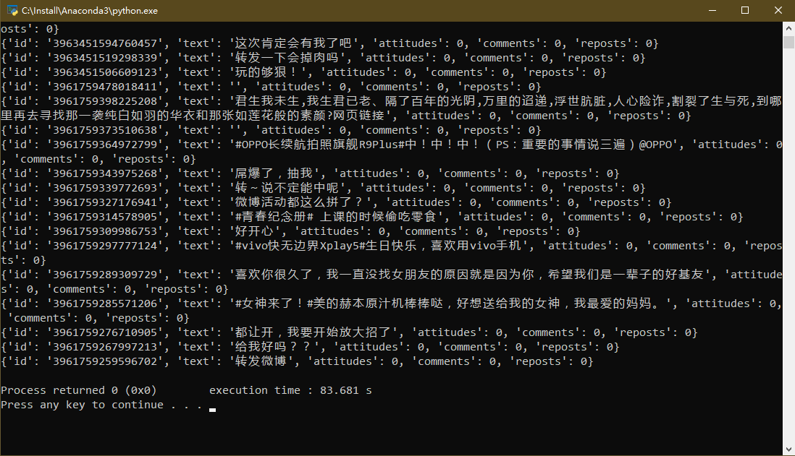

# Python3 网络爬虫课程
## Ajax
有时候我们明明在浏览器中可以看到某个标签和元素,但是requests请求下来的html文档就是不存在这个元素这是怎么回事呢?  
这是因为requests请求到的是原始的HTML文档,而浏览器中的页面是经过Javascript处理后生成的结果,这些数据有可能是通过Ajax加载的,也有可能是经过Javascript的处理和转换得到的.  
针对这种情况,我们使用requests库并不能获取到有效数据,应该怎么做呢?  
我们应该分析网页后台向接口发送的Ajax请求,然后使用requests来模拟Ajax请求,就可以抓取了.  
### 什么是Ajax
Ajax全称为Asynchronous Javascript and XML, 即异步的Javascript和XML.它可以保证在页面不刷新、页面链接不改变的情况下与服务器进行数据交换。  
### 基本原理
发送Ajax请求到网页更新这个过程大概可以分为三步。
#### 发送请求
大家应该知道，Javascript可以实现页面的各种交互功能，Ajax当然也不例外。  
下面的代码是Javascript对Ajax的最底层的实现，时间上就是新建了XMLHttpRequest对象，然后调用onreadystatechange属性设置监听，然后就用open()和send()方法向某个链接发送请求。
```
var xmlhttp;
if(window.XMLHttpRequest) {
  xmlhttp = new XMLHttpRequest();
} else {
  xmlhttp = new ActiveXObject("Microsoft.XMLHTTP");
}
xmlhttp.onreadystatechange = function() {
  if(xmlhttp.readyState == 4 && xmlhttp.status == 200) {
    document.getElementById("myDiv").innerHTML = xmlhttp.responseText;
  }
}
xmlhttp.open("POST","/ajax",true);
xmlhttp.send();
```
#### 解析内容
得到响应之后，onreadystatechange属性对应的方法便会被触发，此时利用xmlhttp的responseText属性便可以获取到响应的内容。

#### 渲染网页
javascript有改变网页内容的能力，解析完响应内容后，就可以调用javascript来针对解析完的内容进行下一步的处理了。

### Ajax分析
这里可以借用chrome浏览器的开发者工具,使用chrome浏览器打开https://m.weibo.cn/u/2830678475, 在页面上右键选择inspect,就会弹出开发者工具.  
  
此时在Elements选项卡中即可看到网页的源代码,右侧是节点的样式.  
我们点击network选项卡,重新刷新页面,发现下面出现了很多条目.  
  
Ajax的请求类型为xhr,我们点击xhr.   
   
查看这些请求,发现有一个其preview标签显示的内容和网页中的内容一致.  
  
点击其Headers标签,发现其x-requested-with: XMLHttpRequest,这表示这就是一个Ajax请求.  
  
切到preview标签,我们看到其内容为json串,其包含昵称、简介、头像等。Javascript获取到这些数据后，在进行渲染。  
另外,我们切到Response选项卡,查看其返回的真实的数据.  
  
### Ajax结果提取
滑动微博页面,观察发现,不断有Ajax请求发出,分析其url:  
```
https://m.weibo.cn/api/container/getIndex?display=0&retcode=6102&type=uid&value=2830678475&containerid=1076032830678475
https://m.weibo.cn/api/container/getIndex?display=0&retcode=6102&type=uid&value=2830678475&containerid=1076032830678475&page=2
https://m.weibo.cn/api/container/getIndex?display=0&retcode=6102&type=uid&value=2830678475&containerid=1076032830678475&page=3
```
发现其有六个参数,display=0,retcode=6102,type=uid,value=2830678475,containerid=1076032830678475, page,每次刷新,只有page会变化.  
查看其响应,发现其最关键的信息就是cardlistInfo和cards下面的内容.  
### 实战
我们抓取微博的前五页.只有page可变.  
首先我们定义url的不可变部分,即base_url, 然后构造参数字典,并使用urlencode()方法将参数编码.  
```
import requests
from urllib.parse import urlencode

base_url = 'https://m.weibo.cn/api/container/getIndex?'
headers = {
    'Host': 'm.weibo.cn',
    'Referer': 'https://m.weibo.cn/u/2830678475',
    'User-Agent': 'Mozilla/5.0 (Windows NT 10.0; WOW64) \
        AppleWebKit/537.36 (KHTML, like Gecko) Chrome/74.0.3729.169 Safari/537.36',
    'x-Requested-with': 'XMLHttpRequest'
}

def get_page(page):
    params = {
        'display': 0,
        'retcode': 6102,
        'type': 'uid',
        'value': '2830678475',
        'containerid': '1076032830678475',
        'page': page
    }
    url = base_url + urlencode(params)
    try:
        response = requests.get(url, headers=headers)
        if response.status_code == 200:
            return response.json()
    except requests.ConnectionError as e:
        print('Error', e.args)
```
然后我们定义一个解析方法,从结果中提取我们需要的数据.  
观察cards.mblog下面的数据,取微博的id,正文(text),赞数(attitudes_count),评论数(comments_count),转发数(reposts_count),然后构造为字典并返回.  
```
from pyquery import PyQuery as pq

def parse_page(json):
    items = json.get('data').get('cards')
    for item in items:
        item = item.get('mblog')
        weibo = {}
        weibo['id'] = item.get('id')
        weibo['text'] = pq(item.get('text')).text()
        weibo['attitudes'] = item.get('attitudes_count')
        weibo['comments'] = item.get('comments_count')
        weibo['reposts'] = item.get('reposts_count')
        yield weibo
```
写个main函数,遍历获取前五页的内容.  
```
if __name__ == '__main__':
    for page in range(1, 6):
        json = get_page(page)
        results = parse_page(json)
        for result in results:
            print(result)
```
  
我们也可以将其存储到MongoDB之中,如下:  
```
from pymongo import MongoClient
client = MongoClient()
db = client['weibo']
collection = db['weibo']
def save_to_mongo(result):
    if collection.insert_one(result):
        print('Saved to Mongo')

if __name__ == '__main__':
    for page in range(1, 6):
        json = get_page(page)
        results = parse_page(json)
        for result in results:
            save_to_mongo(result)
```

