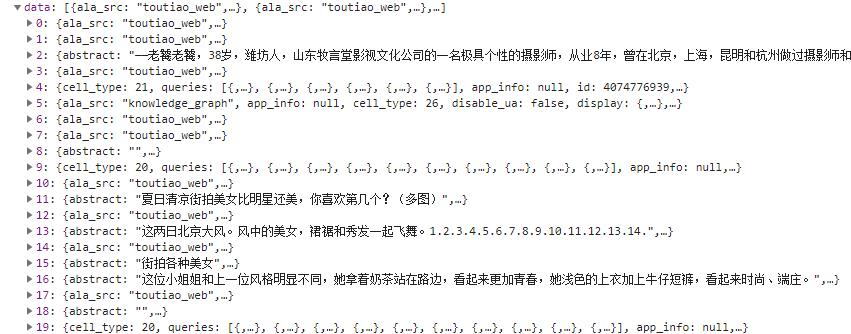

# Python3 网络爬虫课程
## 分析Ajax抓取百度图片
### 准备工作
请首先安装requests库，不再赘述。  
### 分析Ajax
开始之前,使用浏览器打开https://www.toutiao.com/.  
  
在其首页的搜索栏中输入街拍美女.  
  
打开开发者工具,查看XHR网络请求,点击第一个请求.  
  
然后切换到Preview标签,发现其返回的时json串,点击其data字段:  
  
