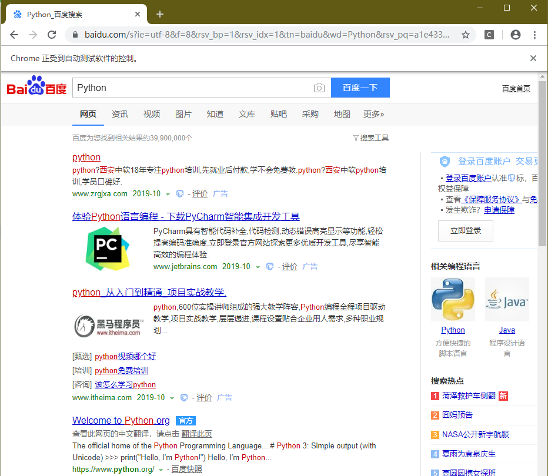
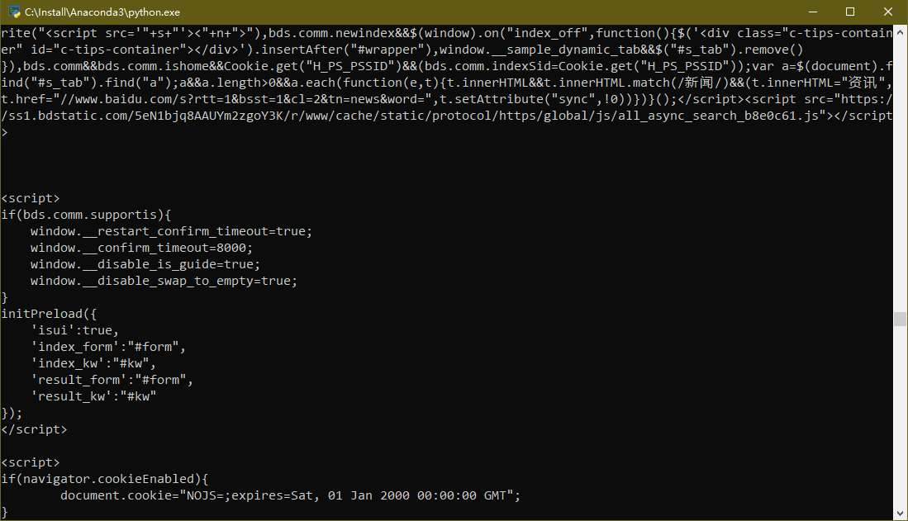
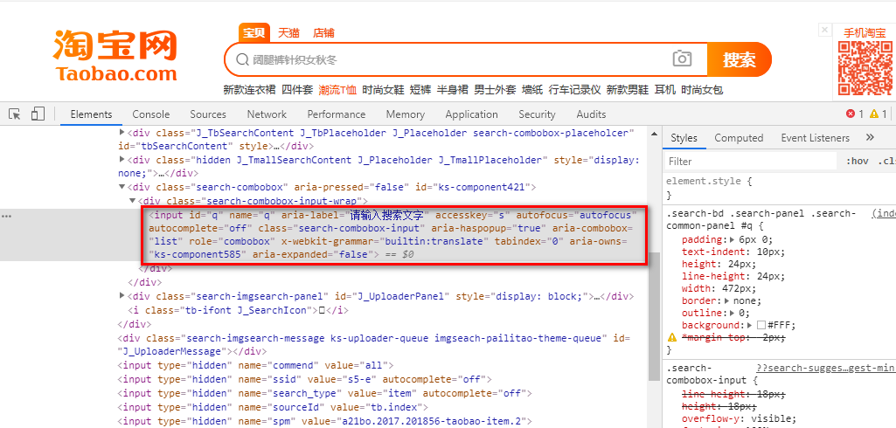
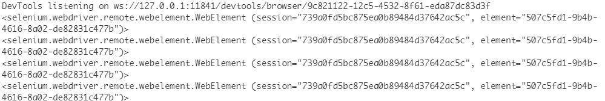
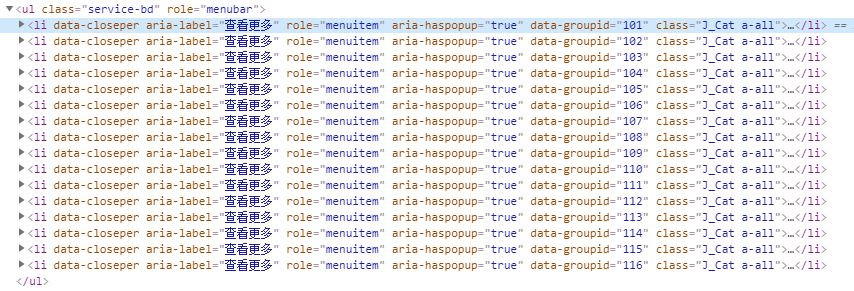
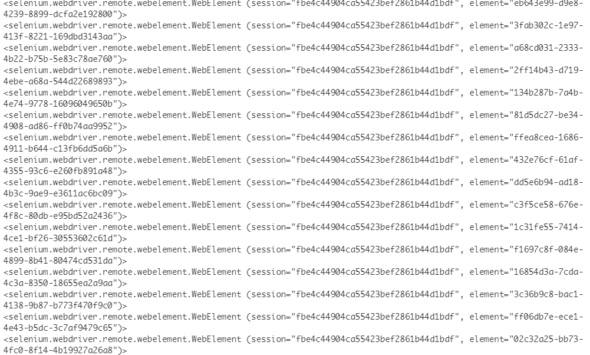
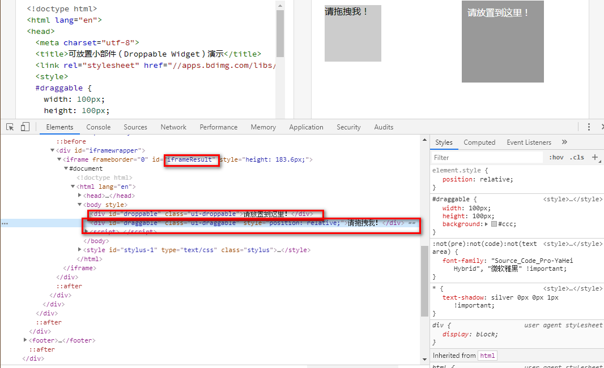

# Python3 网络爬虫课程

## 使用 selenium 爬取动态网页

上一节中使用了分析 ajax 的方式抓取网页,但是不是所有的动态网页都是 ajax 生成的,有的是直接由 Javascript 生成的.  
还有一些网页可能它的 Ajax 接口有加密参数,分析其 Ajax 接口非常困难.  
为了解决这些问题,我们可以使用模拟浏览器的方式来进行抓取,这样,在浏览器中看到什么,我们就会抓到什么,可见即可爬,不用在管网页内部的 Javascript 用了什么算法渲染页面,也不用管后来 ajax 接口有哪些参数.  
Python 提供了 Selenium 库来模拟浏览器的运行.

### Selenium 的使用.

Selenium 是一个自动化的测试工具,利用它可以驱动浏览器执行特定的动作,如点击\下拉等操作,同时还能获取浏览器当前呈现的页面的源代码.对于一些 Javascript 动态渲染的页面来说,此种抓取方法非常有效.

#### 准备工作

本节将以 Chrome 浏览器为例来讲解 Selenium 的用法,在开始本节课程之前,请按照第一节第二节的课程安装并配置好 Chrome 浏览器,ChromeDriver 驱动,Selenium 库等.

#### 基本使用

准备工作做好后,下面看一个例子.

```
from selenium import webdriver
from selenium.webdriver.common.by import By
from selenium.webdriver.common.keys import Keys
from selenium.webdriver.support import expected_conditions as EC
from selenium.webdriver.support.wait import WebDriverWait
import time

browser = webdriver.Chrome()
try:
    browser.get('https://www.baidu.com')
    input = browser.find_element_by_id('kw')
    input.send_keys('Python')
    input.send_keys(Keys.ENTER)
    wait = WebDriverWait(browser, 10)
    wait.until(EC.presence_of_element_located((By.ID, 'content_left')))
    print(browser.current_url)
    print(browser.get_cookies())
    print(browser.page_source)
finally:
    time.sleep(10)
    browser.close()
```

运行代码后,会自动弹出以恶 Chrome 浏览器,浏览器会先跳转到百度,然后搜索 Python,接着跳转到搜索结果页,然后关闭.  
  
后台也会打印出 HTML 代码.  


#### 浏览器对象

Selenium 支持多种多样的浏览器如 chrome、Firefox、Internet Explorer、Microsoft Edge 等，还支持 Android 等手机浏览器，支持 PhantomJs、ChromeHeadless 无头浏览器等。
可以使用如下方式初始化 browser 对象。

```
from selenium import webdriver
browser = webdriver.Chrome() //初始化Chrome对象
browser = webdriver.Firefox()
browser = webdriver.Edge()
browser = webdriver.Internet()
browser = webdriver.PhantomJs()
browser = webdriver.Safari()
```

#### 访问页面

浏览器对象初始化完成后，我们可以使用 get()方法来请求网页，参数传入 URL 即可。

```
from selenium import webdriver

browser = webdriver.Chrome()
browser.get('https://www.baidu.com')
print(browser.page_source)
browser.close()
```

#### 查找结点

Selenium 可以驱动浏览器完成各种操作,如填充表单、模拟点击等。  
比如我们想完成在某个文本框输入的动作，首先得定位到文本框，而 Selenium 提供了一系列查找节点的方法。

##### 单个节点

如果我们想找到淘宝的搜索框，首先得观察淘宝网页的源代码:  

我们发现,这个 input 的 id 为 q,name 还是为 q。还有一些其他的属性，比如 class 为 search-combobox-input 等，我们可以利用其这些属性来定位这个节点。

```
from selenium import webdriver

browser = webdriver.Chrome()
browser.get('https://www.taobao.com')
# 使用ID查找节点
input1 = browser.find_element_by_id('q')
# 使用CSS选择器查找
input2 = browser.find_element_by_css_selector('#q')
# 使用XPATH查找
input3 = browser.find_element_by_xpath('//*[@id="q"]')
# 使用name进行查找
input4 = browser.find_element_by_name('q')
print(input1,input2,input3,input4)
browser.close()
```

我们使用了四种方式来定位 input 节点.

Selenium 一共提供了八种获取单个节点的方法:

```
find_element_by_id
find_element_by_name
find_element_by_xpath
find_element_by_link_text
find_element_by_partial_link_text
find_element_by_tag_name
find_element_by_class_name
find_element_by_css_selector
```

另外,Selenium 还提供了通用方法 find_element(),它需要传入两个参数,查找方式 By 和值。如下：

```
from selenium import webdriver
from selenium.webdriver.common.by import By

browser = webdriver.Chrome()
browser.get('https://www.taobao.com')
input = browser.find_element(By.ID, 'q')
print(input)
browser.close()
```

#### 多个节点

前面介绍的方法都只能查找单个节点，如果要查找多个节点，怎么用呢？
比如我们要查找这些节点.  

我们可以这样实现:

```
from selenium import webdriver

browser = webdriver.Chrome()
browser.get('https://www.taobao.com')
# 使用CSS选择器查找
input1 = browser.find_elements_by_css_selector('.service-bd li')
# 使用XPATH查找
input2 = browser.find_elements_by_xpath('//ul[@class="service-bd"]/li')
print(input1,input2)
browser.close()

```

运行结果如下:  

和上面类似, Selenium 一共提供了八种方法定位多个节点:

```
find_elements_by_id
find_elements_by_name
find_elements_by_xpath
find_elements_by_link_text
find_elements_by_partial_link_text
find_elements_by_tag_name
find_elements_by_class_name
find_elements_by_css_selector
```

Selenium 也提供了通用的获取多个节点的方法,和上面类似的 find_elements

```
from selenium import webdriver
from selenium.webdriver.common.by import By

browser = webdriver.Chrome()
browser.get('https://www.taobao.com')
# 使用CSS选择器查找
input = browser.find_elements(By.CSS_SELECTOR, '.service-bd li')
print(input)
browser.close()
```

#### 节点交互

Selenium 可以驱动浏览器来执行一系列操作,如输入文字、清空文字、点击按钮等。

```
from selenium import webdriver
import time

browser = webdriver.Chrome()
browser.get('https://www.taobao.com')
input = browser.find_element_by_id('q')
input.send_keys('Python')
time.sleep(2)
input.clear()
input.send_keys('Selenium')
button = browser.find_element_by_css_selector('btn-search')
button.click()
```

#### 动作链

Selenium 还支持鼠标拖拽、键盘按键等操作，比如我们将一个节点从某个位置拖动到另一个位置。  
比如我们想拖动这个元素:
  
我们先打开网页，定位到源位置和目标位置，接着声明 ActionChains 对象，调用其方法实现拖拽操作。

```
from selenium import webdriver
from selenium.webdriver import ActionChains

browser = webdriver.Chrome()
browser.get('https://www.runoob.com/try/try.php?filename=jqueryui-api-droppable')
browser.switch_to.frame('iframeResult')
source = browser.find_element_by_css_selector('#draggable')
target = browser.find_element_by_css_selector('#droppable')
actions = ActionChains(browser)
actions.drag_and_drop(source, target)
actions.perform()
```

#### 执行 javascript

如果我们用到了某些 Selenium API 未提供的功能的话，应该怎么操作呢？  
比如下拉进度条，我们可以直接使用 execute_script()方法来执行 Javascript。

```
from selenium import webdriver

browser = webdriver.Chrome()
browser.get('https://www.zhihu.com/explore')
browser.execute_script('window.scrollTo(0, document.body.scrollHeight)')
```

#### 获取节点信息

我们前面演示过，通过 browser 对象的 page_source 属性可以获取到网页的源代码，接着我们可以使用解析库如 beautifulsoup、pyquery 等来解析。当然，Selenium 自身也提供了非常好用的选择、获取节点的方法。

##### 获取属性

我们可以使用 get_attribute()方法来获取节点的属性，如下：

```
from selenium import webdriver

browser = webdriver.Chrome()
browser.get('https://www.zhihu.com/explore')
logo = browser.find_element_by_class_name('Zi--LabelSpecial')
print(logo)
print(logo.get_attribute('class'))
```

运行结果如下:

```
DevTools listening on ws://127.0.0.1:7421/devtools/browser/43f6c918-e772-4676-ab39-07bcc739ba2f
<selenium.webdriver.remote.webelement.WebElement (session="17a9e3ea8ffe4417278574a63054faf1", element="55950b46-f868-4c85-abb0-bc4f6f68d899")>
Zi Zi--LabelSpecial
```

##### 获取文本

我们可以使用它的 text 属性来获取文本信息,类似于 beautifulsoup 的 get_text()方法,pyquery 的 text()方法。

```
from selenium import webdriver

browser = webdriver.Chrome()
browser.get('https://www.zhihu.com/explore')
text = browser.find_element_by_class_name('ExploreSpecialCard-title')
print(text.text)
```

运行结果如下:

```
DevTools listening on ws://127.0.0.1:7895/devtools/browser/5dbe2109-d8d3-46da-a9b5-ef6f7a9f6aab
足球萌新的主队选择指南
```

##### 获取 id、位置、标签名和大小

webelement 节点还有一些其他属性，如 id、location、tag_name、size 等，如下：

```
from selenium import webdriver

browser = webdriver.Chrome()
browser.get('https://www.zhihu.com/explore')
text = browser.find_element_by_class_name('ExploreSpecialCard-title')
print(text.id)
print(text.location)
print(text.tag_name)
print(text.size)
```

运行结果如下:

```
DevTools listening on ws://127.0.0.1:8837/devtools/browser/18648856-7c7b-417f-9b3a-f7db0238f865
1bac70b4-b3d1-4845-a779-b61615901285
{'x': 24, 'y': 308}
a
{'height': 28, 'width': 330}
```

#### 切换 Frame

网页中有一种节点叫做 iframe，就是子 frame，相当于页面的子页面，它的结构和外层的网页结构是相同的。Selenium 打开页面后，它默认实在父 frame 中操作的，如果此时页面中还有子 frame，它是不能获取到子 frame 中的节点的，下面就看看 Selenium 怎么获取子 frame 中的节点。

```
from selenium import webdriver
from selenium.common.exceptions import NoSuchElementException

browser = webdriver.Chrome()
browser.get('https://www.runoob.com/try/try.php?filename=jqueryui-api-droppable')
browser.switch_to.frame('iframeResult')
try:
    logo = browser.find_element_by_class_name('logo')
except NoSuchElementException:
    print('No logo')
    browser.switch_to.parent_frame()
    logo = browser.find_element_by_class_name('logo')
    print(logo)
    print(logo.text)
finally:
    browser.close()
```

执行结果如下:

```
DevTools listening on ws://127.0.0.1:10031/devtools/browser/de6e232b-6def-420a-addf-200a9123c400
[6056:13056:1021/110056.171:ERROR:shader_disk_cache.cc(257)] Failed to create shader cache entry: -2
No logo
<selenium.webdriver.remote.webelement.WebElement (session="bbb4112e5276c3adc1e6aa508fe56a83", element="db3d5173-e338-409d-8201-83285aa4cbea")>
RUNOOB.COM
```

#### 延时等待

Selenium 中,get()方法会在网页加载结束后停止执行,此时如果获取 page_source,可能获取到的源码并不是网页完全加载结束后的源码,某些节点可能在里面找不到。如某些页面有额外的 Ajax 请求，那么我们就不一定能成功获取到相关信息了。  
Selenium 提供了两种方式来解决这个问题： 一种是显式等待，一种是隐式等待。

##### 隐式等待

```
from selenium import webdriver
from selenium.common.exceptions import NoSuchElementException

browser = webdriver.Chrome()
browser.implicitly_wait(10)
browser.get('https://www.zhihu.com/explore')
browser.find_element_by_class_name('ExploreSpecialCard-title')
```

##### 显式等待

隐式等待只规定了一个固定的时间,而页面的加载方式会受各方面因素的影响,所以这种方式并不好;所以我们可以用显式等待来指定要查找的节点,然后指定一个最长的等待时间。

```
from selenium import webdriver
from selenium.webdriver.common.by import By
from selenium.webdriver.support.ui import WebDriverWait
from selenium.webdriver.support import expected_conditions as EC

browser = webdriver.Chrome()
browser.get('https://www.taobao.com')
wait = WebDriverWait(browser, 10)
try:
    input = wait.until(EC.presence_of_element_located((By.ID, 'q')))
    button = wait.until(EC.element_to_be_clickable((
        By.CSS_SELECTOR, '.btn-search')))
    print(input)
    print(button)
except Exception as e:
    print('Not find the element')
    print(e)
finally:
    browser.close()
```

执行结果如下:

```
DevTools listening on ws://127.0.0.1:12202/devtools/browser/2cf36223-732c-4dbc-bda5-ab6596544245
<selenium.webdriver.remote.webelement.WebElement (session="a6bc5ca09d90a0963d9f2392c54d7aa6", element="e5799a6c-5a49-4911-ae36-65183f31b39a")>
<selenium.webdriver.remote.webelement.WebElement (session="a6bc5ca09d90a0963d9f2392c54d7aa6", element="98d47a6c-8cef-4d64-a488-c512799d4335")>
```

关于等待条件,其实很多,比如判断标题内容、判断是否出现了某文字等等，下面列出一些常用的等待条件。

| 等待条件                               | 含义                                                 |
| -------------------------------------- | ---------------------------------------------------- |
| title_is                               | 标题是某内容                                         |
| title_contains                         | 标题包含某内容                                       |
| presence_of_element_located            | 定位的节点是否已存在 ，传入定位元组，如(By.ID, 'q')) |
| visibility_of_element_located          | 定位的节点是否可见，传入定位元组                     |
| visibility_of                          | 定位的节点是否可见，传入节点对象                     |
| presence_of_all_element_located        | 所有定位节点是否加载完成                             |
| text_to_be_present_in_element          | 节点是否包含某文字                                   |
| text_to_be_present_in_element_value    | 节点值是否包含某文字                                 |
| frame_to_be_available_and_switch_to_it | 加载并切换                                           |
| invisible_of_element_located           | 定位的节点不可见                                     |
| element_to_be_clickable                | 定位的节点可点击                                     |
| staleness_of                           | 判断节点是否仍在 DOM，可用于判断页面是否已刷新       |
| element_to_be_selected                 | 节点是否已被选择，传入节点对象                       |
| element_located_to_be_selected         | 节点是否已被选择，传入定位元组                       |
| element_selection_state_to_be          | 传入节点对象和状态，相等则 True，否则 False          |
| element_located_selection_state_to_be  | 传入定位元组和状态，相等则 True，否则 False          |
| alert_is_present                       | 是否出现警告                                         |

#### 前进和后退

我们的浏览器上有前进和后退按钮，Selenium 也提供了前进和后退方法。

```
from selenium import webdriver
import time

browser = webdriver.Chrome()
browser.get('https://www.baidu.com')
browser.get('https://www.python.org')
browser.get('https://www.taobao.com')
browser.back()
time.sleep(2)
browser.forward()
browser.close()
```

#### Cookies

Selenium 可以方便的对 Cookie 进行操作,如获取、添加、删除、修改等。

```
from selenium import webdriver
import time

browser = webdriver.Chrome()
browser.get('https://www.zhihu.com/explore')
print(browser.get_cookies())
browser.add_cookie(
    {'name': 'Amy', 'domain': 'www.hehe.com', 'value': 'chinas'})
print(browser.get_cookies())
browser.delete_all_cookies()
print(browser.get_cookies())
```

运行结果如下:

```
DevTools listening on ws://127.0.0.1:14220/devtools/browser/c214ae18-154c-40a1-ac39-fe5575d40671
[{'domain': '.zhihu.com', 'httpOnly': False, 'name': 'Hm_lpvt_98beee57fd2ef70ccdd5ca52b9740c49', 'path': '/', 'secure': False, 'value': '1571628988'}, {'domain': '.zhihu.com', 'expiry': 1603164988, 'httpOnly': False, 'name': 'Hm_lvt_98beee57fd2ef70ccdd5ca52b9740c49', 'path': '/', 'secure': False, 'value': '1571628988'}, {'domain': 'www.zhihu.com', 'expiry': 1571629886.945573, 'httpOnly': False, 'name': 'tgw_l7_route', 'path': '/', 'secure': False, 'value': '4860b599c6644634a0abcd4d10d37251'}, {'domain': '.zhihu.com', 'expiry': 1666236986.945683, 'httpOnly': False, 'name': 'd_c0', 'path': '/', 'secure': False, 'value': '"AEAseXcsOxCPTjcPX-mQBaV5ByAIqx-vgQI=|1571628986"'}, {'domain': '.zhihu.com', 'httpOnly': False, 'name': '_xsrf', 'path': '/', 'secure': False, 'value': '49c55e1c-bf1e-496e-ac1e-96bcfe0fb474'}, {'domain': '.zhihu.com', 'expiry': 1634700986.945633, 'httpOnly': False, 'name': '_zap', 'path': '/', 'secure': False, 'value': '19f5b497-1d89-4119-b5d1-587737b0e465'}]
[{'domain': '.zhihu.com', 'httpOnly': False, 'name': 'Hm_lpvt_98beee57fd2ef70ccdd5ca52b9740c49', 'path': '/', 'secure': False, 'value': '1571628988'}, {'domain': '.zhihu.com', 'expiry': 1603164988, 'httpOnly': False, 'name': 'Hm_lvt_98beee57fd2ef70ccdd5ca52b9740c49', 'path': '/', 'secure': False, 'value': '1571628988'}, {'domain': 'www.zhihu.com', 'expiry': 1571629886.945573, 'httpOnly': False, 'name': 'tgw_l7_route', 'path': '/', 'secure': False, 'value': '4860b599c6644634a0abcd4d10d37251'}, {'domain': '.zhihu.com', 'expiry': 1666236986.945683, 'httpOnly': False, 'name': 'd_c0', 'path': '/', 'secure': False, 'value': '"AEAseXcsOxCPTjcPX-mQBaV5ByAIqx-vgQI=|1571628986"'}, {'domain': '.zhihu.com', 'httpOnly': False, 'name': '_xsrf', 'path': '/', 'secure': False, 'value': '49c55e1c-bf1e-496e-ac1e-96bcfe0fb474'}, {'domain': '.zhihu.com', 'expiry': 1634700986.945633, 'httpOnly': False, 'name': '_zap', 'path': '/', 'secure': False, 'value': '19f5b497-1d89-4119-b5d1-587737b0e465'}]
[{'domain': 'www.zhihu.com', 'expiry': 1571629889.132371, 'httpOnly': False, 'name': 'tgw_l7_route', 'path': '/', 'secure': False, 'value': 'a37704a413efa26cf3f23813004f1a3b'}]
```

#### 选项卡管理

我们使用浏览器的时候会打开一个个选项卡,在 Selenium 中,我们也可以对选项卡进行操作。

```
from selenium import webdriver
import time

browser = webdriver.Chrome()
browser.get('https://www.zhihu.com/explore')
browser.execute_script('window.open()')
print(browser.window_handles)
browser.switch_to.window(browser.window_handles[1])
browser.get('https://www.baidu.com')
time.sleep(2)
browser.switch_to.window(browser.window_handles[0])
browser.get('https://www.taobao.com')
```

执行结果如下:

```
DevTools listening on ws://127.0.0.1:14973/devtools/browser/470b2804-c684-4d3f-b5ff-7528eb02a68a
['CDwindow-DFF6EE3FE90123D7D220E743B4D7B302', 'CDwindow-A2DCA0ECF4C0C00FC9DF28CA359CCD08']
```

#### 异常处理

在 selenium 中难免会遇到一些异常,比如节点未找到,超时等。一旦出现异常程序便不会执行了，如果我们写个爬虫，出现异常爬虫就终止了，这是不行的，所以我们可以使用 try except 语句来捕获各种异常。

```
from selenium import webdriver
from selenium.common.exceptions import TimeoutException, NoSuchElementException
import time

browser = webdriver.Chrome()
try:
    browser.get('https://www.zhihu.com/explore')
except TimeoutException:
    print('Timeout')
try:
    browser.find_element_by_id('hehe')
except NoSuchElementException:
    print('No such element')
finally:
    browser.close()
```
