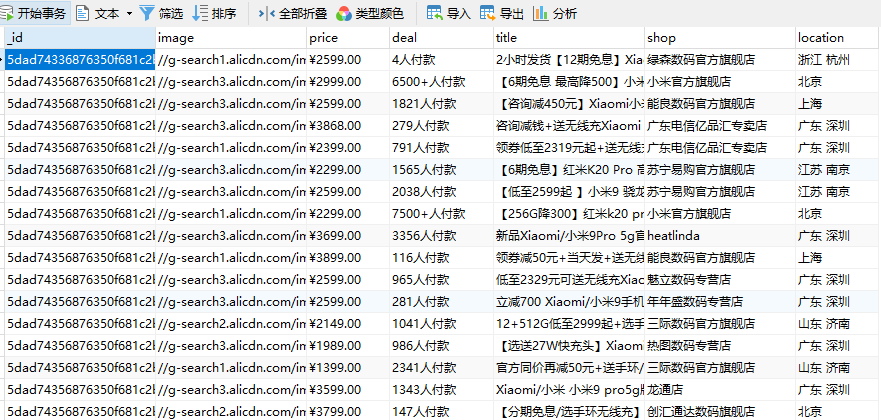

# Python3 网络爬虫课程

## 使用 selenium 爬取淘宝商品

本节我们将使用前面学习过的 Selenium 来抓取淘宝商品，使用 pyquery 解析商品的各种信息，最终的结果将保存到 Mongodb 中。

### 准备工作

我们还是以 Chrome 为例来进行讲解，开始之前，请确保正确安装了 Chrome 浏览器并配置好了 ChromeDriver，另外还要确保 Selenium 库安装正确。  
我们最后也会对接 PhantomJS 和 Firefox，请确保安装好 PhantomJS 和 Firefox 以及其驱动 GeckoDriver。

### 分析页面

我们打开淘宝页面，搜索“小米 9”，页面中包含很多商品信息，如商品图片、名称、价格、购买数、店铺名称、店铺所在地等等。

抓取入口 url 为'https://s.taobao.com/search?q=小米9',可以直接通过构造这个url来访问。  
在页面下方,有分页导航,包含前五页的连接,也包含下一页的链接,同时还有一个跳转到某页的链接。  

可以看到,商品最大页数为 100 页,要获取每一页的内容,我们只需要按页码遍历即可。

### 获取商品列表

首先我们构造 URL，'https://s.taobao.com/search?q=小米9'，这个URL只需要更改q的value就可以更换搜索关键字，就可以获取不同的商品列表。
URL 构造完成之后,我们访问这个 URL,然后判断当前页面是不是第一页,如果是第一页,我们判断一下商品列表是否已经加载,如果加载完成,则调用获取商品信息的函数 get_shopping();如果不是第一页,我们先定位到跳转文本框,输入 page,点击跳转按钮进行跳转,然后再判断商品列表是否已经加载,然后调用获取商品信息的函数 get_shopping()。

```
from selenium import webdriver
from selenium.common.exceptions import TimeoutException
from selenium.webdriver.common.by import By
from selenium.webdriver.support import expected_conditions as EC
from selenium.webdriver.support.wait import WebDriverWait
from urllib.parse import quote

browser = webdriver.Chrome()
wait = WebDriverWait(browser, 10)
KEYWORD = '小米9'

def parse_page(page):
    print('正在爬取{}页'.format(str(page)))
    try:
        url = 'https://s.taobao.com/search?q={}'.format(quote(KEYWORD))
        browser.get(url)
        if page > 1:
            input = wait.until(
                EC.presence_of_element_located((
                    By.CSS_SELECTOR, '#mainsrp-pager div.form > input')))
            submit = wait.until(EC.element_to_be_clickable(
                (By.CSS_SELECTOR, '#mainsrp-pager div.form > span.btn J_Submit')))
            input.clear()
            input.send_keys(page)
            submit.click()
        wait.until(EC.text_to_be_present_in_element(
            (By.CSS_SELECTOR, '#mainsrp-pager li.item.active > span'), str(page)))
        wait.until(EC.presence_of_element_located(
            (By.CSS_SELECTOR, '.m-itemlist .items .item')))
        get_shopping()
    except TimeoutException:
        parse_page(page)
    except Exception as e:
        print(e)
```

### 解析商品信息

这个就是实现我们的 get_shopping()函数,我们直接获取网页源代码,然后通过 pyquery 来进行解析,解析出商品信息后调用 save_to_mongo()方法将其存储到 MongoDB。

```
from pyquery import PyQuery as pq

def get_shopping():
    html_source = browser.page_source
    doc = pq(html_source)
    items = doc('#mainsrp-itemlist .items .item').items()
    for item in items:
        good = {
            'image': item.find('.pic .img').attr('data-src'),
            'price': item.find('.price').text(),
            'deal': item.find('.deal-cnt').text(),
            'title': item.find('.title').text(),
            'shop': item.find('.shop').text(),
            'location': item.find('.location').text()
        }
        print(good)
        save_to_mongo(good)
```

### 保存到 MongoDB

接下来我们将抓取到的信息保存到 MongoDB,即实现 save_to_mongo()函数。

```
import pymongo

MONGO_URL = 'localhost'
MONGO_DB = 'taobao'
MONGO_COLLECTIONS = 'goods'
client = pymongo.MongoClient(MONGO_URL)
db = client[MONGO_DB]

def save_to_mongo(result):
    try:
        if db[MONGO_COLLECTIONS].insert_one(result):
            print('存储到MongoDB成功')
    except Exception:
        print('存储到MongoDB失败')
```

### 遍历页面

我们的 parse_page()函数需要接受一个 page 参数,我们下面实现页码遍历。

```
MAX_PAGE = 100

def main():
    for page in range(1, MAX_PAGE + 1):
        parse_page(page)
```

我们运行一下:

