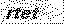

# Python3 网络爬虫课程

## 图形验证码的识别

目前,很多网站都采取了各种各样的反爬措施,其中之一便是使用验证码.随着技术的发展,验证码却来越复杂,花样越来越多,爬虫的工作也变得愈加复杂,本节将介绍图形验证码的识别.

### 图形验证码

我们首先将识别最简单的验证码,图形验证码.

#### 目标

我们将以知网为例讲解使用 OCR 技术识别图形验证码.

#### 准备

需要安装 tesseract 和 tesserocr 库,请看第一节和第二节内容.

#### 获取验证码

我们将从这里获取验证码:

```
http://my.cnki.net/elibregister/CheckCode.aspx
```

然后点击右键,将验证码图片保存下来.

#### 测试

我们新建一个文件 rec_simple_vcode.py 文件,然后将上面保存的图片和此文件放在同一个路径下:  


```
import tesserocr
from PIL import Image

image = Image.open('code.png')
result = tesserocr.image_to_text(image)
print(result)
```

我们创建了一个 Image 对象,调用了 tesserocr 库的 image_to_text()方法,传入该 image 即可识别.  
  
另外 tesserocr 还可以使用 file_to_text()方法直接将图片转换为字符串.

```
import tesserocr

result = tesserocr.file_to_text('code.png)
print(result)
```

#### 处理

我们换一个验证码,将其命名为 code2.png.  
  
重新用下面的代码识别:

```
import tesserocr
from PIL import Image

image = Image.open('code2.png')
result = tesserocr.image_to_text(image)
print(result)
```

发现其输出结果为:  
  
识别错误,识别出来的字符串和实际结果有偏差,这是因为验证码内多余的线条干扰了图片的识别.  
对于这种情况,我们需要进行额外的处理,比如灰度化、二值化等。  
我们可以使用 Image.convert('L)将图片灰度化。

```
image = image.convert('L')
image.show()
```

  
二值化:  
  
还可以设置二值化的阈值.默认阈值为 127,我们先将图片灰度化,然后指定阈值二值化.

```
image = image.convert('L')
threshold = 110
table = []
for i in range(256):
    if i < threshold:
        table.append(0)
    else:
        table.append(1)
image = image.point(table, '1')
image.show()
```

看看这么处理后的结果:  
  
我们处理过后的图片黑白分明,里面干扰的线条已经全部被除去,这是重新识别验证码:

```
import tesserocr
from PIL import Image

image = Image.open('code2.png')
image = image.convert('L')
threshold = 110
table = []
for i in range(256):
    if i < threshold:
        table.append(0)
    else:
        table.append(1)
image = image.point(table, '1')
result = tesserocr.image_to_text(image)
print(result)
```

识别结果如下:  

