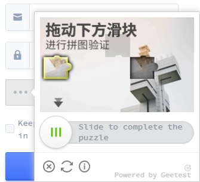
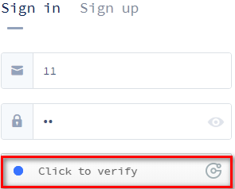
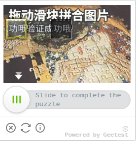

# Python3 网络爬虫课程

## 极验滑动验证码的识别

上一节了解了简单验证码的识别,但是现在这种验证码非常少见,现在出现了一大批新型的验证码,如极验滑动验证码,它需要拖动合并滑块才能完成识别。

### 目标

本节目标是识别极验滑动验证码，如分析思路、识别缺口、生成拖动路径、模拟合并等。

### 准备

需要安装 Python 的 selenium 库，需要安装 Chrome 浏览器并配置好驱动 ChromeDriver。请参考第一节第二节的内容。

### 了解

如图,就是这种类型的验证码。


### 识别

我们使用浏览器模拟的方式来识别此验证码,链接为("https://auth.geetest.com/login/")。  
我们点击如下所示处:  

然后会弹出如下所示的图片:  

然后我们拖动滑块，使滑块和图片缺口对齐，则通过验证。  


### 思路

归纳一下，识别大概分为三步：

1. 模拟点击验证按钮
2. 识别图片缺口位置
3. 拖动滑块
   第一步操作很简单,我们可以直接使用 selenium 模拟点击。
   第二步识别缺口的位置很关键，需要使用到图像处理相关的方法。我们观察图片，缺口的四周有明显的断裂痕迹,边缘和边缘周围有明显的区别。可以实现一个边缘检测算法来寻找缺口的位置，对于极验滑动验证码来说，可以利用和原图对比的方式来识别缺口的位置，点击验证按钮，未拖动滑块时图片是完成的，当拖动图片时才会显示缺口，我们可以获取这两张图片，设定一个阈值，遍历图片，找出两张图片相同位置像素 RGB 差距超过此阈值的像素点，那么这个像素点就是缺口的位置。  
   第三步操作看似简单，但实际坑很多。极验滑动验证码增加了机器轨迹识别、匀速移动、随机速度移动等方式，这些方式都不能通过验证，只有完全模拟人的移动轨迹才可以通过识别。人的移动轨迹一般时先加速后减速，我们要模拟这个过程。

### 初始化

我们的链接为("https://auth.geetest.com/login/")。这里首先做一些初始化的配置。

```
from selenium import webdriver
from selenium.webdriver.support.wait import WebDriverWait
EMAIl = '1111111@qq.com'
PASSWORD = '1111111'


class CrackGeetest():
    def __init__(self):
        self.url = 'https://auth.geetest.com/login/'
        self.browser = webdriver.Chrome()
        self.wait = WebDriverWait(self.browser, 10)
        self.email = EMAIl
        self.password = PASSWORD
```

### 模拟点击

实现第一步操作,即模拟点击,我们定义一个方法来获取这个按钮。

```
def get_geetest_button(self):
        button = self.wait.until(EC.element_to_be_clickable(
            (By.CLASS_NAME, 'geetest_radar_tip')))
        return button
```

随后我们调用 click()方法点击这个按钮即可。

```
button = self.get_geetest_button()
button.click()
```

### 识别缺口

#### 获取不带缺口图片

我们先获取不带缺口的位置，利用 selenium 获取图片元素，得到其所在位置、宽高等，然后获取网页的截图，裁剪图片。

##### 获取网页截图

```
def get_screenshot(self):
        screenshot = self.browser.get_screenshot_as_png()
        screenshot = Image.open(BytesIO(screenshot))
        return screenshot
```

##### 获取验证码图片的位置

```
 def get_postion(self):
        image = self.wait.until(EC.presence_of_element_located(
            (By.CLASS_NAME, 'geetest_canvas_img ')))
        time.sleep(2)
        location = image.location
        size = image.size
        top, bottom, left, right = location['y'], location['y'] + \
            size['height'], location['x'], location['x'] + size['width']
        return (top, bottom, left, right)
```

##### 裁剪图片,得到验证码图片

```
def get_geetest_image(self):
        top, bottom, left, right = self.get_postion()
        print('验证码位置:', top, bottom, left, right)
        screenshot = self.get_screenshot()
        captcha = screenshot.crop((top, bottom, left, right))
        return captcha
```

#### 获取带缺口的图片

##### 首先获取滑块

```
def get_slider(self):
        slider = self.wait.until(EC.element_to_be_clickable(
            (By.CLASS_NAME, 'geetest_slider_button')))
        return slider
```

利用 get_slider()方法获取到滑块对象，然后点击 clikc()方法，缺口图片即可呈现。

```
slider = get_slider()
slider.click()
```

##### 调用 get_geetest_image()方法获取带缺口图片

#### 获取缺口

我们遍历两张图片的每个坐标点，获取到两张图片对应像素点的 RGB 数值。如果二者的 RGB 数值差在一定范围内，那就代表两个像素相同，继续对比下一个像素，如果差距超过一定范围，则当前位置即为缺口位置。  
is_pixel_equal()方法用于判断两张图片同一位置的像素是否相同,get_gap()方法用于获取缺口位置。

```
def is_pixel_equal(self, image1, image2, x, y):
        pixel1 = image1.load()[x, y]
        pixel2 = image2.load()[x, y]
        threshold = 60
        if abs(pixel1[0] - pixel2[0]) < threshold \
                and pixel1[1] - pixel2[1] < threshold \
            and pixel1[2] - pixel2[2] < threshold:
            return True
        else:
            return False

def get_gap(self, image1, image2):
    left = 60
    for i in range(left, image1.size[0]):
        for j in range(image1.size[1]):
            if not self.is_pixel_equal(image1, image2, i, j):
                left = i
                return left
    return left
```

### 模拟拖动

模拟拖动过程不复杂,但坑很多,匀速移动极验滑动会识别出他是程序的操作,因为人是无法做到匀速移动的,极验滑动使用机器学习模型来识别是否为机器操作。
我们尝试模拟加速减速过程来进行验证，前段滑块做匀加速运动，后段做匀减速运动。  
我们尝试定义 get_track()方法,传入移动总距离,返回移动轨迹

```
def get_track(self, distance):
        track = []
        current = 0
        mid = distance * 4 / 5
        t = 0.2
        v = 0

        while current < distance:
            if current < mid:
                a = 2

            else:
                a = -3
            v0 = v
            v = v0 + a * t
            move = v0 * t + 1/2 * a * t * t
            current += move
            track.append(round(move))
        return track
```

最后,我们按照移动轨迹来拖动滑块。

```
def move_to_gap(self, slider, track):
        ActionChains(self.browser).click_and_hold(slider).perform()
        for x in track:
            ActionChains(self.browser).move_by_offset(
                xoffset=x, myoffset=0).perform()
        time.sleep(1)
        ActionChains(self.browser).release().perform()
```
