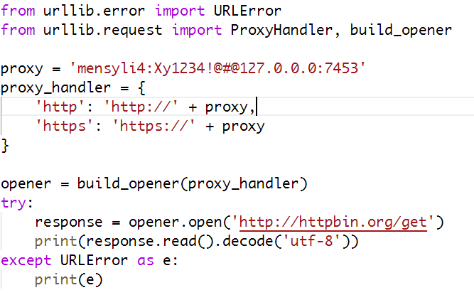
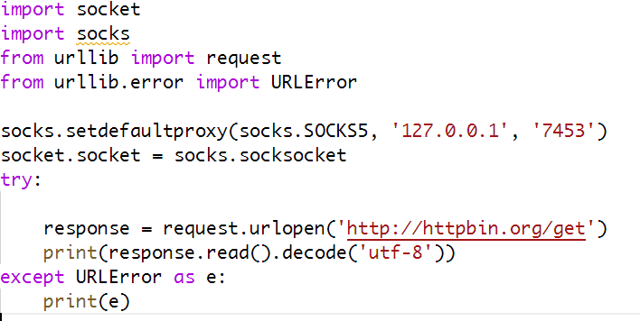

urllib 库一般使用 ProxyHandler 设置代理，参数是字典类型，键名是协议。当创建完 ProxyHandler 对象后，我们可以使用 build_opener()方法创建一个 Opener，此时这个 Opener 已经设置好代理了，我们使用 Opener 的 open()方法打开某个 URL，就会使用代理去访问这个网址。

### 如果我们想设置 http、https 代理

### 设置 SOCKS5 代理

