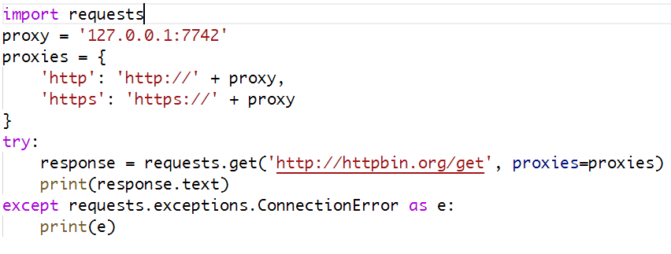
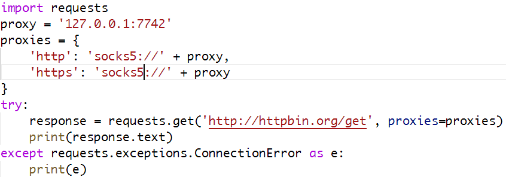
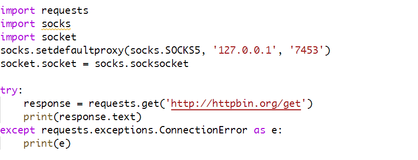

# Python3 网络爬虫课程

## requests 设置代理

requests 库设置代理非常简单，只需要传入 proxies 参数即可。

### requests 设置 http(s)代理



### requests 设置 socks5 代理

如果要使用 requests 设置 socks5 代理，我们需要安装模块 requests[socks]

```
pip install requests[socks]
```



### 也可以使用 socks 模块设置代理

和 urllib 中的方法相同，而且这种方法设置的代理是全局代理。

