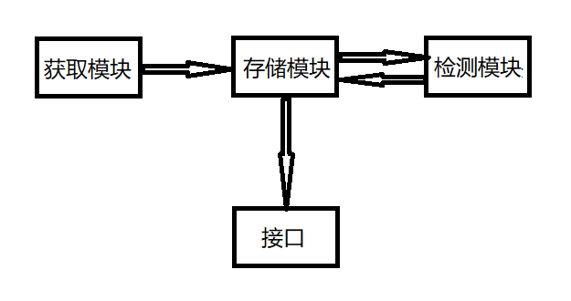

# Python3 网络爬虫课程

## Proxy 池

网上存在者大量的 Proxy，也有很多的付费 Proxy，不论是免费的还是付费的，都未必是可用的，因为这个 Proxy 可能被其他人使用访问相同的目标站点而被封禁，或者 Proxy 服务器发生故障，或者网络问题等等，都有可能导致此 Proxy 不可用，一旦我们选用了一个不可用 Proxy，势必会影响我们抓取的效率。  
所以，一般我们开始抓取之前，都需要对代理进行筛选，将不可用的代理筛掉。

### 准备

1. 我们要安装 Redis 内存数据库。
2. 安装 aiohttp
3. 安装 requests
4. 安装 redis-py
5. 安装 pyquery
6. 安装 Flask  
   具体的安装方法请看第一节、第二节的内容。

### 目标

我们的 Proxy 池需要实现以下几个功能。

#### 存储

负责存储抓取下来的 Proxy。首先应该保证 Proxy 是唯一的、不重复的，需要表示 Proxy 的可用情况，其次要动态实时的处理每个代理，所以我们这里使用 Redis 的 SortedSet 来存储 Proxy。

#### 获取

定时在各个提供 Proxy 的网站上抓取 Proxy，可以是免费公开的 Proxy，也可以是付费的 Proxy，尽量从不同来源获取 Proxy，尽量抓取匿名 Proxy，成功后将其存入 Redis 的 SortedSet 中。

#### 检测

定时检测 Redis 中的 Proxy，最好设置一个检测链接，一般来说我们需要访问那个目标网站我们就检测哪个网站，这样针对性更好，如果要做通用性的 Proxy，那我们可以设置百度为检测网站。另外我们需要标识每一个 Proxy 的状态，比如设置分数，一百分表示可用，零分表示不可用，删除此 Proxy，分数越小表示此 Proxy 越不可用。检测一次，如果 Proxy 可用，我们将分数直接设置为一百满分，当然，也可以在原分基础上加一，策略大家可以自己选择；如果 Proxy 不可用，我们将分数减一，当分数减少到一定阈值之后，我们从 Redis 中删除这个 Proxy，当然，也可能当分数是零的时候再删除。通过这样的分数标识，我们可以识别 Proxy 的可用情况。

#### 接口

我们可以提供一个 HTTP API 来对外提供服务。当然，我们也可以直接查询数据库来获取响应的 Proxy，但是这样得知道数据库的相关信息，并且还需要做数据库相关的配置，比较方便的方法是提供一个 WEB API 接口，这样可以在不暴露数据库信息的情况下对外提供通用的接口。由于 Proxy 可能又多个可用，我们可以随机返回某个 Proxy，这样可以保证每个可用的 Proxy 取到的机会均等。

### 架构

根据功能模块，我们的 Proxy 池架构如下：  
  
存储模块是 Redis 的有序集合，用来做 Proxy 的去重和可用标识。  
获取模块是从各个网站获取 Proxy，然后将 Proxy 传递给存储模块，保存到数据库。  
检测模块定时检测 Redis 中的所有 Proxy,根据不同的结果对其进行不同的标识。  
接口模块通过 WEB API 对外提供通用接口。
