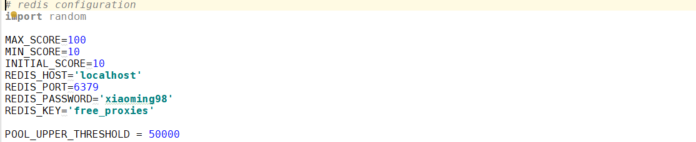
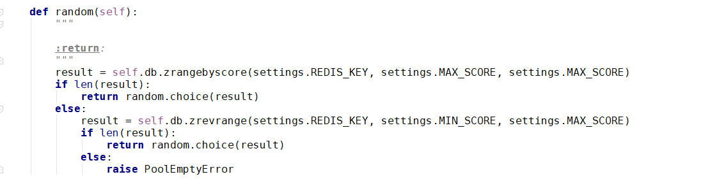

### 存储模块

我们使用 Redis 的有序集合来存储 Proxy，集合中的每个元素都是不重复的，对 Proxy 池来说，集合的元素就是一个个 Proxy，即 IP:PORT 的形式，这样的一个形式就是集合中的一个元素。  
此外，有序集合的每个元素会有一个分数，分数是可以重复的，可以是浮点类型，也可以是整形，这个集合会对根据每一个元素的分数进行排序，分数小的排前面，分数大的排后面。  
对于我们的 Proxy 池来说，这个分数可以作为一个判断 Proxy 是否可用的标识，100 分最高，表示可用，0 最低，表示不可用。  
我们从 Proxy 池中随机获取 Proxy，这样就可以保证每个 Proxy 都可以被调用到。  
分数是我们判断代理池是否稳定可用的标识，规则如下:

- 分数一百标识当前 Proxy 可用，检测器循环检测每个 Proxy，一旦检测到又可用 Proxy，立即将其分数设置为一百；如果 Proxy 不可用，则将其分数减一，一旦分数为零后，立即删除此 Proxy。
- 新获取的 Proxy 分数为十， 如果测试可行，分数立即设置为一百，如果不可行，则其分数减一，直至减为零后移除此 Proxy。
  
  
  
  
  
  
  
  

* MAX_SCORE: 表示最大分数
* MIN_SCORE: 表示最小分数
* INIT_SCORE: 初始分数
* REDIS_HOST: redis 主机地址
* REDIS_PORT: redis 服务端口
* REDIS_PASSWORD: redis 服务密码
* REDIS_KEY: 集合键名
* **init**()初始化方法，初始化 Redis 链接对象
* add()方法向数据库添加 Proxy 并设置初始分数 INIT_SCORE
* random()方法随机放回 Proxy
* decrease()方法将分数减一，如果分数为零，则移除
* exsits()方法判断 Proxy 是否在集合中
* max()方法将 Proxy 的分数设置为 MAX_SCORE
* count()方法返回集合中元素的个数
* all()方法返回所有的 Proxy 列表
